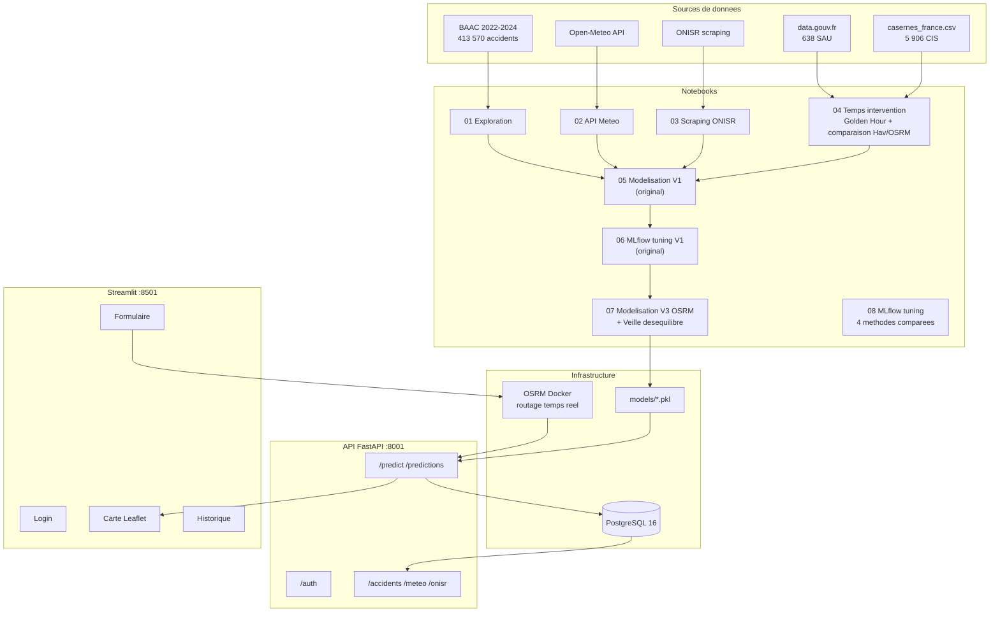
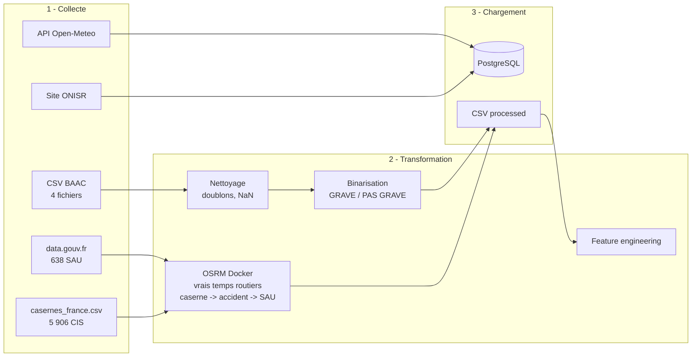
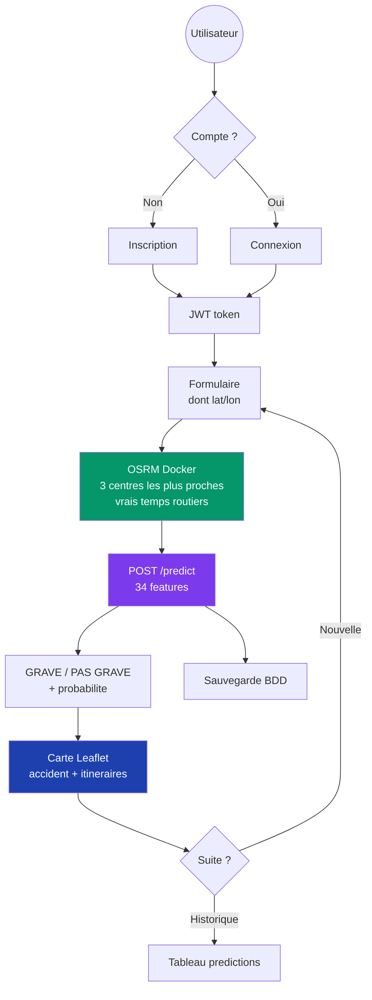
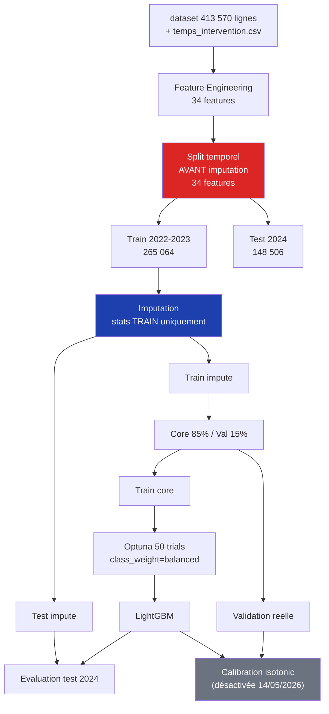
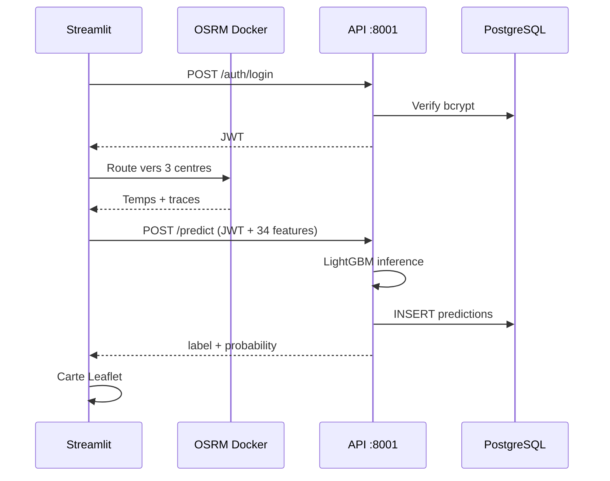
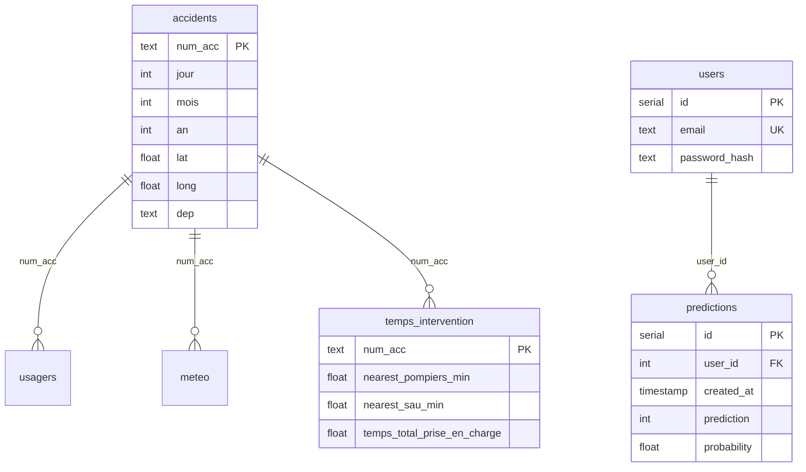

# RouteZone

**Prediction de la gravite des accidents routiers en France metropolitaine**

[](https://github.com/Meriem69/Routezone/actions/workflows/tests.yml)


Projet de certification RNCP37827 -- Developpeur en Intelligence Artificielle -- Simplon x Microsoft

---

## Presentation

RouteZone predit si un accident routier est **grave** (tue ou hospitalise) ou **pas grave** (indemne ou blesse leger), a partir des donnees BAAC 2022-2024.

Le projet integre une analyse du "golden hour" : correlation prouvee (p < 1e-26 en V3 OSRM) entre le temps d'intervention des secours et le taux de deces.

**Modele en production : V3 OSRM** (LightGBM, recall 0.7643, AUC 0.8558, F1 0.6956).
Les features de temps d'intervention sont calculees avec OSRM (vrais temps routiers,
153 054 accidents enrichis), remplacant l'approximation Haversine x 1.3 de la V2.

---

## Architecture



---

## Pipeline ETL



---

## Parcours utilisateur



---

## Pipeline ML



---

## Golden Hour

**Rappel définition**
L'heure d'or est un concept de médecine d'urgence. La plupart des blessés graves (polytraumatisé, ou bien victime d'une hémorragie interne) meurent dans les premières heures. On a donc un taux de survie optimal si la victime se retrouve sur une table d'opération dans l'heure qui suit l'accident.

Correlation prouvee entre temps d'intervention et deces (72 123 blesses graves).

**V2 Haversine x 1.3** (approximation) :

| Temps total | Taux deces | n |
|---|---|---|
| < 5 min | **10.0%** | 14 252 |
| 10-15 min | 14.7% | 9 677 |
| 20-30 min | 16.5% | 15 465 |
| > 30 min | **17.4%** | 10 444 |

Chi2 p = 5.8e-20.

**V3 OSRM** (mesure routiere reelle, 153 054 accidents) :

| Temps total | Taux deces | n |
|---|---|---|
| < 5 min | **8.2%** | 936 |
| 10-15 min | 12.4% | 14 287 |
| 20-30 min | 16.0% | 20 034 |
| > 30 min | **17.3%** | 12 172 |

Chi2 p = **6.6e-27** (effet renforce, +38% vs V2).

OSRM revele aussi **+47% de zones blanches** que Haversine ne voyait pas
(11 102 -> 16 305 accidents avec temps total > 30 min).

---

## Resultats (test 2024, 148 506 usagers)

**Modele V3 OSRM final** (deploye dans l'API + Streamlit) :

```
              precision    recall  f1-score   support
  Pas grave       0.94      0.78      0.85    123 037
      Grave       0.42      0.76      0.54     25 469
  accuracy                            0.78    148 506
  macro avg       0.68      0.77      0.70    148 506
```

Comparaison historique :

| Metrique | V1* | V2 Haversine | V3 OSRM | Best |
|---|---:|---:|---:|---|
| Recall | 0.805 | 0.784 | **0.7643** | ~ V1 |
| Precision | 0.390 | 0.405 | **0.4166** | V3 |
| **F1 macro** | 0.676 | 0.689 | **0.6956** | V3 |
| **AUC-ROC** | 0.850 | 0.855 | **0.8558** | V3 |
| Gap train-test recall | ? | +9.7% | **+4.25%** | V3 |

*V1 : data leakage (split aleatoire + imputation globale)*

**34 features V3.** Top : `temps_total_osrm` (rang #1 en V3, vs rang #4 en V2),
catv, age, col, vma. La feature OSRM **devient l'information la plus discriminante**
du modele.

### Comparaison des 3 strategies V3

**Note** : Plusieurs variantes ont été expérimentées et conservées
dans `models/` pour traçabilité. **Le modèle V3 OSRM "vanilla"
(best_model_v3_osrm.pkl) est servi en production** pour sa cohérence
métier et l'interprétabilité de ses probabilités. Les variantes
Optuna existent dans le repo mais ne sont pas servies par l'API.

| Approche | Recall | AUC | Gap train-test | Verdict |
|---|---:|---:|---:|---|
| **V3 OSRM (best_model_v3_osrm.pkl)** | **0.7643** | **0.8558** | -- | **Servi en production** |
| V3 Optuna scoring=AUC | 0.7397 | 0.8544 | +14.5% | Non servi (AUC ne penalise pas le gap) |
| V3 Optuna scoring=recall + early stopping | 0.7802 | 0.8569 | +4.25% | Meilleur recall, non servi |

Hyperparametres V3 final : `max_depth=9`, `learning_rate=0.012`, `num_leaves=45`,
`min_child_samples=153`, `subsample=0.74`, `colsample_bytree=0.65`,
`n_estimators=1000` avec early stopping (patience=50 sur val).

---

## Evolution du modele

### 14 mai 2026 - Desactivation du calibrator isotonique

Un CalibratedClassifierCV avec calibration isotonique avait été
ajouté au pipeline initial. Après évaluation empirique sur le
test 2024, j'ai constaté que la calibration dégradait sévèrement
les performances métier :

| Métrique | Modèle brut | Calibrator isotonic | Delta |
|---|---:|---:|---:|
| Recall GRAVE | 0.7643 | 0.3299 | **-0.4344** |
| Precision GRAVE | 0.4166 | 0.6504 | +0.2338 |
| F1 macro | 0.6956 | 0.6772 | -0.0185 |
| AUC-ROC | 0.8558 | 0.8458 | -0.0099 |

Le calibrator faisait passer 67% des accidents réellement graves
en "Pas grave" — l'inverse de l'objectif métier de sécurité
routière.

**Décision** : retirer le calibrator du flux de prédiction tout en
conservant le fichier pour traçabilité (cf. `src/api/routes_ia.py`).

---

## Veille desequilibre

| Strategie | Recall test | Verdict |
|---|---|---|
| **class_weight="balanced"** | **0.784** | **Retenu -- stable** |
| SMOTE-NC | 0.613 | Overfitting |
| Baseline | faible | -- |
| Threshold 0.35 | haut recall, basse precision | -- |

---

## Flux JWT



---

## Schema BDD



---

## Structure du projet

```
routezone/
├── bdd/
│   ├── create_db.sql                       # 8 tables + index
│   └── import_data.py                      # Import CSV -> PostgreSQL
├── data/
│   ├── raw/
│   │   └── casernes_france.csv             # 5 906 CIS
│   └── processed/
│       ├── dataset_clean.csv
│       ├── centres_urgences.csv            # 638 SAU (emergency=yes)
│       └── temps_intervention.csv          # 413K temps (5 features)
├── docker/
│   ├── Dockerfile.api
│   └── requirements_api.txt
├── models/                                 # Artefacts ML
├── notebooks/
│   ├── 01_exploration                      # EDA, nettoyage
│   ├── 02_api_meteo                        # Enrichissement meteo
│   ├── 03_scraping_onisr                   # Scraping ONISR
│   ├── 04_temps_intervention               # SAU + casernes + golden hour
│   │                                       # + comparaison Haversine vs OSRM (cells 25-32)
│   ├── 05_modelisation_v1                  # Baseline RF, XGB, LightGBM (original Meriem)
│   ├── 06_mlflow_tuning_v1                 # Optuna V1 (original Meriem)
│   ├── 07_modelisation_v3_osrm             # V3 OSRM + veille desequilibre
│   └── 08_mlflow_tuning                    # 4 methodes comparees (Tuning manuel, GridSearch, Optuna F1, Optuna Recall)
├── src/
│   ├── api/                                # API unifiee FastAPI
│   │   ├── main.py
│   │   ├── db.py
│   │   ├── security.py                     # API key + JWT + bcrypt
│   │   ├── routes_data.py                  # /accidents, /meteo, /onisr
│   │   ├── routes_ia.py                    # /predict (auto-load V3 si dispo, sinon V2)
│   │   └── routes_auth.py                  # /auth/*
│   ├── app.py                              # Streamlit + Folium + OSRM
│   └── scripts/
│       ├── enrich_osrm_batch.py            # Orchestrateur Docker region par region
│       ├── train_v3_optuna_final.py        # Retrain V3 final (script)
│       ├── optuna_v3_recall_es.py          # Optuna V3 (recall + early stopping)
│       ├── check_overfit_v3.py             # Verif gap train/val/test
│       └── run_comparison_v2.py            # Comparaison Hav vs OSRM (offline)
├── tests/test_api.py
├── docker-compose.yml                      # PostgreSQL + OSRM + API
├── osrm_prepare.bat                        # Pre-prep OSRM (regions Geofabrik)
├── .env
└── requirements.txt
```

---

## Lancement

### Premiere installation

```bash
git clone https://github.com/Meriem69/Routezone.git
cd routezone
cp .env.example .env

# Lancer les services (PostgreSQL + API)
docker-compose up -d

# Importer les donnees
python bdd/import_data.py

# Executer les notebooks 01 a 08 dans Jupyter (dans l'ordre)

# (Optionnel mais recommande pour V3)
# Enrichir le dataset avec les vrais temps OSRM (~2h, 22 regions Geofabrik)
python src/scripts/enrich_osrm_batch.py --regions all --keep-pbf

# Entrainer le modele V3 OSRM (~10 min Optuna 30 trials + ES)
python src/scripts/optuna_v3_recall_es.py
# -> sauvegarde models/best_model_v3_osrm.pkl
# -> l'API V3 sera auto-chargee au prochain redemarrage

# Redemarrer l'API pour charger V3
docker-compose restart api

# Lancer l'interface (utilise OSRM live pour les temps d'intervention)
streamlit run src/app.py
```

### Lancement quotidien

```bash
docker-compose up -d
streamlit run src/app.py
```

### Verification

```bash
curl http://localhost:8001/       # Health check
curl http://localhost:8001/docs   # Swagger
pytest tests/ -v                  # Tests
```

---

## Endpoints (port 8001)

| Route | Auth | Description |
|-------|------|-------------|
| `GET /` | Public | Health check |
| `POST /auth/register` | Public | Inscription |
| `POST /auth/login` | Public | Connexion |
| `GET /auth/me` | JWT | Infos user |
| `GET /accidents` | API Key | Liste filtrable |
| `GET /accidents/stats` | API Key | Statistiques |
| `GET /accidents/departement/{dep}` | API Key | Par departement |
| `GET /accidents/gravite` | API Key | Repartition |
| `GET /meteo/stats` | API Key | Stats meteo |
| `GET /onisr/barometre` | API Key | Barometre |
| `POST /predict` | API Key ou JWT | Prediction |
| `GET /predictions` | JWT | Historique |

---

## Securite

| Mesure | Implementation |
|--------|---------------|
| Mots de passe | bcrypt |
| Tokens | JWT HS256 |
| Cle API | hmac.compare_digest |
| Auth /predict | API key **ou** JWT |
| Secrets | .env hors du repo |
| Docker | User non-root |

---

## Stack technique

| Composant | Technologie |
|-----------|------------|
| API | FastAPI, APIRouter |
| BDD | PostgreSQL 16, SQLAlchemy |
| Auth | JWT (python-jose), bcrypt |
| ML | LightGBM, Optuna |
| Routage | OSRM Docker |
| Carte | Folium, streamlit-folium |
| Frontend | Streamlit |
| Tracking | MLflow |
| Tests | pytest, TestClient |

---


## CI/CD

A chaque push sur `master`, GitHub Actions execute les 35 tests sur un service PostgreSQL 16. Si les tests passent, l'image Docker de l'API est automatiquement construite et publiee sur le registre GitHub (GHCR) : `ghcr.io/meriem69/routezone:latest`. Le packaging et la livraison de l'image sont donc automatises ; le deploiement continu sur serveur distant reste la prochaine etape.

---

## Competences RNCP37827

| C1 | Automatiser l'extraction des donnees | notebooks 01-04, import_data.py |
| C2 | Developper les requetes SQL d'extraction | bdd/ |
| C3 | Nettoyer et agreger les donnees | notebook 01, pipeline de nettoyage |
| C4 | Creer la base de donnees (Merise + RGPD) | bdd/create_db.sql, PostgreSQL |
| C5 | Developper l'API REST de donnees | src/api/routes_data.py |
| C6 | Veille technique et reglementaire | docs/actualite.md, rapport E2 |
| C7 | Benchmark des services d'IA | rapport E2 |
| C8 | Parametrer le service d'IA | docker/, models/ |
| C9 | Developper l'API exposant le modele | src/api/routes_ia.py |
| C10 | Integrer l'API du modele dans l'application | src/app.py |
| C11 | Monitorer le modele (MLOps) | MLflow, monitoring/ |
| C12 | Tests automatises du modele | tests/ (35 tests pytest) |
| C13 | Chaine de livraison continue du modele | .github/workflows/, GHCR |
| C14 | Analyser le besoin (specs, user stories) | rapport E4 |
| C15 | Concevoir le cadre technique (architecture) | README.md (schemas Mermaid) |
| C16 | Coordonner en methode agile | rapport E4 |
| C17 | Developper composants/interfaces (accessibilite, OWASP) | src/app.py, RGAA |
| C18 | Automatiser les tests du code (CI) | .github/workflows/ |
| C19 | Livraison continue de l'application (Docker) | docker/, GHCR |
| C20 | Surveiller l'application | monitoring/ (Prometheus + Grafana) |
| C21 | Resoudre un incident technique | rapport E5 |

---

## Auteure

**Meriem Abdelouahed** -- Formation Developpeur IA -- Simplon x Microsoft -- 2026
